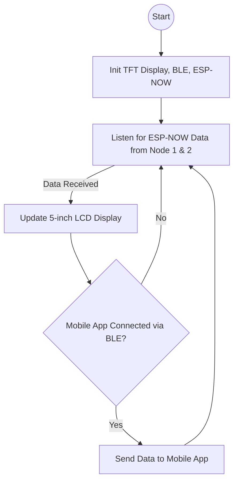
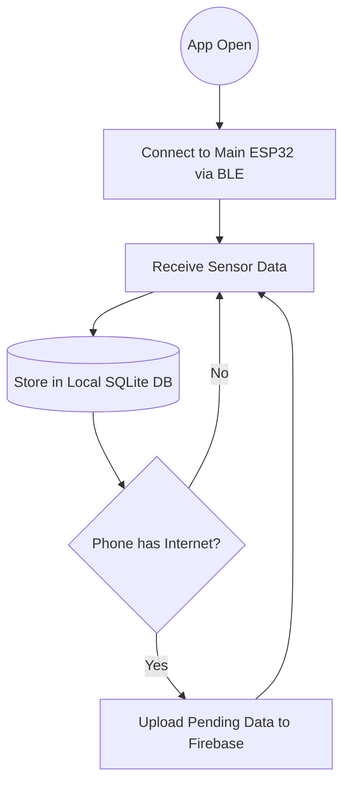
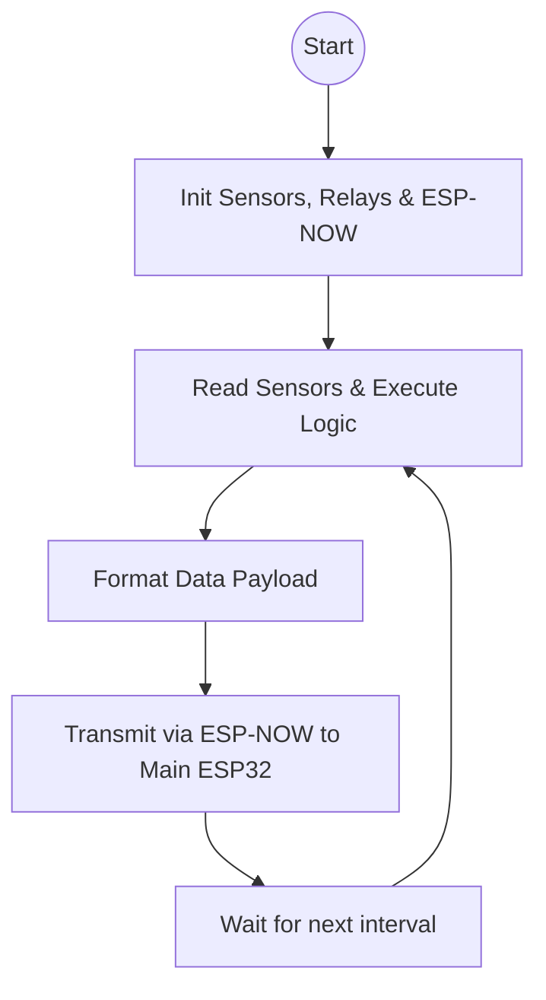

# Multi-Node Architecture & Integration Plan

This plan outlines the updated project phases to include the new architecture with 3 ESP32 boards, Bluetooth/WiFi integration, offline storage, and ML deployment strategy.

## 1. System Architecture Update

The system will now consist of 3 ESP32 boards communicating in a master-slave configuration using **ESP-NOW**:

### Main ESP32 (Hub & Display)
- **Hardware**: ESP32 (38-pin) + 5-inch TFT LCD Touch Screen.
- **Role**: Master node.
- **Tasks**: 
  - Receives data from Sensor Node 1 and Node 2 via **ESP-NOW**.
  - Displays all sensor data on the 5-inch touch screen.
  - Connects to the Mobile App via **Bluetooth (BLE)** for local monitoring and data transfer.
  - Acts as the central hub.

### Sensor Node 1 (Water Quality)
- **Hardware**: ESP32
- **Role**: Handles core water quality sensors.
- **Sensors**: pH, TDS, Turbidity, Pressure, Flow Rate, Level.
- **Tasks**: Reads sensors, applies calibration/filters, and transmits data via **ESP-NOW** to the Main ESP32.

### Sensor Node 2 (Environment & Actuation)
- **Hardware**: ESP32
- **Role**: Handles environmental monitoring and fans.
- **Sensors**: 2x Ultrasonic (tank levels), 1x DHT22 (ambient temp/humidity), 2x Gas sensors (air quality), 2x Water temp sensors (DS18B20), 3x Fans with relays.
- **Tasks**: Reads sensors, runs logic to control fans, and transmits data via **ESP-NOW** to the Main ESP32.

## 2. Answers to Your Questions

### Q: Can we use a local database on the mobile app instead of using an SD card module for offline data?
**Solution: YES, Mobile App Offline Sync.**
This is an excellent approach that removes hardware complexity and eliminates the need for an SD card. 
- **Offline Mode**: The Main ESP32 continuously sends data to the Mobile App via Bluetooth (BLE). 
- **App Storage**: The Flet mobile app will store this incoming data in a local on-device database (like SQLite).
- **Sync Mode**: When the mobile phone connects to WiFi/4G, a background task in the Flet app will sync the local database with Firebase, pushing all pending records.

### Q: Do we need to use Streamlit to integrate the ML models with the dashboard and app? (Will use Vercel for deployment).
**Solution: NO, deploy directly via FastAPI on Vercel.**
You do not need Streamlit. Since you are deploying to **Vercel** (which is a serverless environment), adding Streamlit would complicate things.
- **How to deploy**: We will bundle your `.pkl` models inside your existing **FastAPI backend**. 
- FastAPI will expose a REST endpoint (e.g., `/api/predict`). 
- **Vercel Specifics**: Vercel Serverless Functions have a 250MB deployment limit (unzipped) and 50MB execution limit. We must ensure your `scikit-learn` dependencies and `.pkl` models stay within this size limit. The Flet frontend (also deployed on Vercel) and the mobile app will make standard API calls to this FastAPI endpoint.

### Q: TFT Display Pin Conflicts Recommendation
**Solution: Use an SPI-based LCD, NOT an Arduino Uno Shield.**
An Arduino shield display uses a parallel 8-bit or 16-bit interface, which consumes almost all pins on an ESP32, making it nearly impossible to wire correctly to a standard 38-pin ESP32.
- **Recommendation**: Buy a **5-inch TFT LCD Module with an SPI interface** (usually using the ILI9488 or RA8875 driver). SPI displays only require **4 to 5 pins** (MOSI, SCK, CS, DC, RST), leaving plenty of pins free on your Main ESP32.
- **Alternative Recommendation**: Use an integrated ESP32 Display board (like the "ESP32-8048S050" 5.0 inch or "WT32-SC01 Plus"). These boards come with the 5-inch touch screen pre-wired to the ESP32 internally, saving you all the hassle of manual wiring.

## 3. Flowcharts

### Main ESP32 (Display & Hub) Flowchart

### Mobile App (Offline Sync) Flowchart

### Sensor Node 1 & 2 Flowchart

