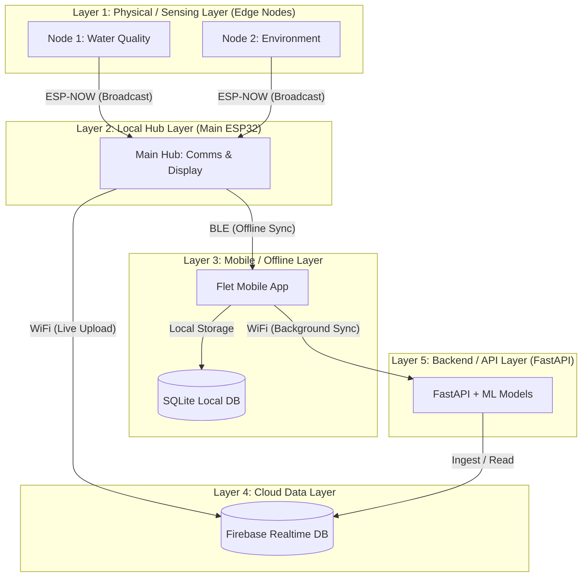
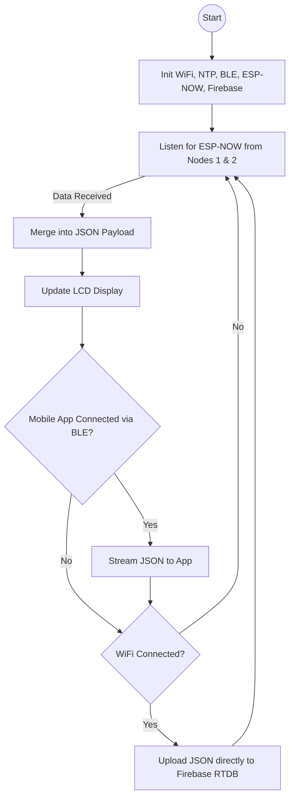
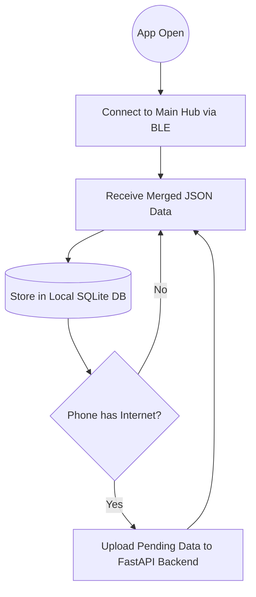

# 🌊 Smart Water Desalination Monitoring & Analytics System
## Phase 1 — Requirements Analysis and System Architecture

> [!NOTE]
> **Design Decisions Log** (Updated after user review)
> - ✅ ML Dataset: Will be synthetically generated in Phase 11 (no real dataset required to start)
> - ✅ Flow Sensor (YF-S201): Included — required for Recovery Rate calculation and pump failure detection
> - ✅ Solenoid Valve: Included — enables automated safety shutoff and remote control
> - ✅ Power Mode: Battery/Solar — ESP32 uses Deep Sleep with dual wake sources (water level sensor + dashboard command)

---

## 📋 Table of Contents

1. [Objectives](#objectives)
2. [Theory](#theory)
3. [Detailed System Explanation](#detailed-system-explanation)
4. [System Architecture Design](#system-architecture-design)
5. [Technology Stack Justification](#technology-stack-justification)
6. [Firebase Database Schema](#firebase-database-schema)
7. [Folder Structure](#folder-structure)
8. [Data Flow Diagram](#data-flow-diagram)
9. [Sensor Specifications & Requirements](#sensor-specifications--requirements)
10. [Non-Functional Requirements](#non-functional-requirements)
11. [Validation Checklist](#validation-checklist)
12. [Common Errors & Troubleshooting](#common-errors--troubleshooting)
13. [Best Practices](#best-practices)

---

## 1. Objectives

| # | Objective | Priority |
|---|-----------|----------|
| 1 | Define all functional and non-functional system requirements | 🔴 Critical |
| 2 | Design the complete multi-layer system architecture | 🔴 Critical |
| 3 | Define sensor data models and measurement ranges | 🔴 Critical |
| 4 | Design the Firebase Realtime Database schema | 🔴 Critical |
| 5 | Define the project folder structure (monorepo) | 🔴 Critical |
| 6 | Define communication protocols between all layers | 🟠 High |
| 7 | Establish data quality and filtering requirements | 🟠 High |
| 8 | Define ML prediction targets and thresholds | 🟠 High |
| 9 | Establish security and authentication model | 🟡 Medium |
| 10 | Define deployment strategy per component | 🟡 Medium |

---

## 2. Theory

### 2.1 Reverse Osmosis (RO) Desalination — Engineering Overview

Reverse Osmosis is a pressure-driven membrane separation process. Feed water is pushed through a semi-permeable membrane that rejects dissolved solids, ions, and organic molecules, producing permeate (purified water) and concentrate (brine reject).

**Key Physical Parameters:**

| Parameter | Symbol | Unit | Role in RO |
|-----------|--------|------|------------|
| pH | pH | 0–14 | Membrane longevity, scaling potential |
| TDS | TDS | mg/L (ppm) | Rejection efficiency measurement |
| Turbidity | NTU | NTU | Pre-filter fouling, feed quality |
| Temperature | T | °C | Membrane permeability, reaction kinetics |
| Pressure | P | bar / PSI | Driving force for permeation |
| Flow Rate | Q | L/min | Recovery rate, system throughput — **Required for efficiency calculations** |
| Water Level | L | % / cm | Tank management, feed availability — **Also used as wake/sleep trigger** |
| EC (Optional) | EC | µS/cm | Salinity proxy, conductivity |

**Critical RO Ratios:**

```
Recovery Rate (%) = (Permeate Flow / Feed Flow) × 100       ← Requires YF-S201 Flow Sensor
Rejection Rate (%) = (1 - Permeate TDS / Feed TDS) × 100   ← Requires TDS Sensor
Salt Passage (%) = (Permeate TDS / Feed TDS) × 100
```

> **Why the Flow Sensor is non-negotiable:** Recovery Rate is the primary KPI of any RO system. Without it, you cannot determine if your system is operating efficiently or if the membrane is degrading. The YF-S201 (~$3) is the cheapest and most impactful sensor in the system.

> **Why the Solenoid Valve is essential for automation:** Without the solenoid valve, your system can only *alert* you to problems. With it, the system can automatically *respond* — for example, immediately closing when TDS spikes above safe levels, protecting downstream equipment and users. This is the difference between a monitoring system and a control system.

**Typical Target Values for Potable Water (WHO Standards):**

| Parameter | Acceptable Range | Alert Threshold |
|-----------|-----------------|----------------|
| pH | 6.5 – 8.5 | < 6.0 or > 9.0 |
| TDS | < 500 mg/L | > 1000 mg/L |
| Turbidity | < 1 NTU | > 4 NTU |
| Temperature | 5 – 30°C | > 40°C |
| Pressure (Feed) | 3 – 8 bar | > 10 bar |

### 2.2 IoT Architecture Patterns

This system uses the **Edge-to-Cloud** IoT architecture:

```
Edge Layer     →   Transport Layer   →   Cloud Layer   →   Application Layer
(ESP32 + Sensors)  (WiFi + MQTT/HTTP)  (Firebase)      (FastAPI + Flet + ML)
```

**Why Edge-to-Cloud?**
- ESP32 handles local data acquisition and preliminary filtering
- Cloud handles persistence, analytics, and multi-client access
- Application layer handles visualization, AI, and prediction

### 2.3 Machine Learning in Water Quality

Random Forest is chosen because:
- Handles non-linear relationships between sensor parameters
- Robust to outliers (critical when sensors malfunction)
- Provides feature importance (explains WHY a prediction was made)
- Works well with tabular sensor data
- Low inference latency (<1ms for 100 trees on sensor data)
- scikit-learn implementation is production-ready

> [!IMPORTANT]
> **No real dataset available at project start.** A realistic synthetic dataset will be generated in Phase 11 using:
> - RO membrane physics equations (rejection rate curves, fouling models)
> - WHO and EPA water quality standards as label boundaries
> - Gaussian sensor noise injection (based on datasheet accuracy specs)
> - Fault scenario injection (membrane fouling, sensor drift, pump cavitation)
> - The synthetic dataset will be used for initial training, then the model will be retrained and fine-tuned using real data collected by the system after deployment.

---

## 3. Detailed System Explanation

### 3.1 System Layers



### 3.2 ESP32 Pin Assignment Plan

> [!NOTE]
> This is the high-level plan for the 3-node architecture. Full pinouts will be finalized in Phase 2 (Hardware Design).

**Node 1 (Water Quality - ESP32 38-pin):**
- pH Feed & Permeate (GPIO34=pH Feed, GPIO36=pH Permeate) — ADC1 only
- TDS Feed & Permeate (GPIO35=TDS Feed, GPIO39=TDS Permeate) — ADC1 only
- Turbidity Feed (GPIO32) — ADC1 only, via 10kΩ/20kΩ voltage divider
- Pressure Feed / G1/4 (GPIO33) — ADC1 only, via 10kΩ/20kΩ voltage divider
- Temperature Feed & Permeate (GPIO4, DS18B20 shared OneWire bus)
- Flow Sensor Feed (GPIO18, interrupt), Flow Permeate (GPIO27, digital interrupt only — ADC2 pin but NOT used for analogRead, safe with WiFi)
- Level Sensors: Feed (GPIO5), Product (GPIO19)
- Relays: Pump (GPIO26), Valve (GPIO25)

**Node 2 (Environment & Fans - ESP32 38-pin):**
- 2x Ultrasonic (Trig/Echo digital pins)
- 1x DHT22 (Digital pin)
- 2x Gas Sensors (ADC1 pins)
- 2x Water Temp (DS18B20 on GPIO4)
- 3x Fans (Relay output pins)

**Main Hub (Display & Comms - ESP32 38-pin):**
- 5-inch SPI TFT Display (MOSI, SCK, CS, DC, RST)
- No analog sensors attached (avoids WiFi/ADC2 conflicts entirely)

> [!IMPORTANT]
> **Mobile App Offline Sync Architecture**
> - The Main ESP32 constantly streams data to the Mobile App via BLE.
> - The App stores data in a local SQLite DB.
> - When internet is available, the App syncs the local DB to Firebase, ensuring zero data loss during WiFi outages.

---

## 4. System Architecture Design

### 4.1 Communication Flowcharts

**Main Hub (Display & Comms) Flowchart**


**Mobile App (Offline Sync) Flowchart**


### 4.2 Communication Protocols

| Layer | Protocol | Format | Frequency |
|-------|----------|--------|-----------|
| Nodes → Main Hub | ESP-NOW | C-Struct | Every 5 sec |
| Main Hub → App | Bluetooth (BLE) | JSON | Every 3 sec |
| Main Hub → Firebase | HTTP / RTDB | JSON | Every 5 sec |
| App → Backend | HTTP POST | JSON | Background Sync |
| Backend → Firebase | Firebase Admin SDK | JSON | On-demand / ingest |
| FastAPI → Dashboard | HTTP GET/POST | JSON | Real-time polling |
| Backend → Gemini | HTTPS | JSON | On-demand chatbot |
| FastAPI → ML Service | Internal Python | Array | On-demand prediction |

---

## 5. Technology Stack Justification

### 5.1 Why ESP32S?
- Dual-core Xtensa LX6 @ 240 MHz — handles sensor reading + WiFi simultaneously
- Built-in WiFi + Bluetooth
- 18 ADC channels (we use ADC1 only during WiFi)
- 4MB flash, 520KB SRAM — sufficient for firmware + buffers
- Low cost, wide community support

### 5.2 Why Firebase Realtime Database?
- Real-time push to all connected clients simultaneously
- JSON tree structure maps naturally to sensor readings
- Built-in security rules
- Free tier: 1GB storage, 10GB/month transfer
- Native SDK for Python, JavaScript, mobile

### 5.3 Why FastAPI?
- Async-first (handles concurrent sensor reads + client requests)
- Auto-generates OpenAPI documentation
- Native Pydantic validation (enforces data schemas)
- Easy ML model integration (Python-native)
- High performance (comparable to Node.js)

### 5.4 Why Flet?
- Write once, run on Web + Android + iOS + Desktop (Python)
- Flutter rendering engine → native-quality UI
- Firebase integration via Python SDK
- Shared codebase for dashboard and mobile app

### 5.5 Why Random Forest?
- No need for feature scaling (unlike SVM, neural nets)
- Interpretable (feature importance)
- Handles missing data gracefully
- Fast inference (<1ms for 100 trees on sensor data)
- scikit-learn implementation is production-ready

### 5.6 Why Google Gemini API?
- Multimodal (can interpret sensor charts + text)
- Domain knowledge of water treatment
- Structured output support (JSON responses)
- Function calling (can query Firebase directly)

---

## 6. Firebase Database Schema

### 6.1 Complete Schema Design

```json
{
  "devices": {
    "device_001": {
      "info": {
        "name": "RO Unit Alpha",
        "location": "Plant A - Zone 1",
        "firmware_version": "1.0.0",
        "registered_at": "2024-01-01T00:00:00Z",
        "last_seen": "2024-01-01T12:00:00Z",
        "status": "online"
      },
      "config": {
        "sampling_interval_ms": 5000,
        "alert_thresholds": {
          "ph_min": 6.5,
          "ph_max": 8.5,
          "tds_max": 1000,
          "turbidity_max": 4.0,
          "temperature_max": 40.0,
          "pressure_max": 10.0,
          "flow_rate_min": 0.5
        },
        "filtering": {
          "algorithm": "kalman",
          "window_size": 10
        }
      },
      "live_data": {
        "ph_feed": 7.2,
        "ph_permeate": 6.9,
        "tds_feed": 850,
        "tds_permeate": 12,
        "turbidity_feed": 0.8,
        "temperature_feed": 24.5,
        "temperature_permeate": 24.2,
        "pressure_feed": 4.2,
        "flow_rate_feed": 2.5,
        "flow_rate_permeate": 1.8,
        "recovery_rate": 72.0,
        "rejection_rate": 98.6,
        "water_level_feed_tank": 100,
        "water_level_product_tank": 0,
        "pump_status": "running",
        "valve_status": "open",
        "tank1_level_cm": 45.5,
        "tank2_level_cm": 20.0,
        "ambient_temp": 32.0,
        "ambient_humidity": 65.0,
        "gas_1_ppm": 400.0,
        "gas_2_ppm": 350.0,
        "water_temp_1": 25.0,
        "water_temp_2": 26.0,
        "fan_1_status": true,
        "fan_2_status": false,
        "fan_3_status": false,
        "timestamp": "2024-01-01T12:00:00Z",
        "uptime_seconds": 3600
      },
      "calibration": {
        "ph": {
          "slope": 1.023,
          "offset": -0.15,
          "temp_coefficient": 0.0198,
          "calibrated_at": "2024-01-01T00:00:00Z",
          "next_calibration_due": "2024-04-01T00:00:00Z"
        },
        "tds": {
          "temp_coefficient": 0.02,
          "calibration_ppm": 1413,
          "calibrated_at": "2024-01-01T00:00:00Z"
        },
        "turbidity": {
          "voltage_at_0_ntu": 4.2,
          "slope": -1120.4,
          "calibrated_at": "2024-01-01T00:00:00Z"
        },
        "pressure": {
          "offset_voltage": 0.5,
          "full_scale_voltage": 4.5,
          "max_pressure_bar": 12.0,
          "calibrated_at": "2024-01-01T00:00:00Z"
        }
      }
    }
  },

  "historical_logs": {
    "device_001": {
      "2024-01-01": {
        "log_001": {
          "ph": 7.2,
          "tds": 320,
          "turbidity": 0.8,
          "temperature": 24.5,
          "pressure_feed": 4.2,
          "flow_rate_feed": 2.5,
          "water_level_feed_tank": 85,
          "recovery_rate": 72.0,
          "rejection_rate": 98.5,
          "timestamp": "2024-01-01T00:00:00Z"
        }
      }
    }
  },

  "alerts": {
    "device_001": {
      "alert_001": {
        "type": "high_tds",
        "severity": "warning",
        "parameter": "tds",
        "value": 1050,
        "threshold": 1000,
        "message": "TDS exceeded maximum threshold (1050 > 1000 ppm)",
        "timestamp": "2024-01-01T12:05:00Z",
        "acknowledged": false,
        "acknowledged_by": null,
        "acknowledged_at": null,
        "resolved": false,
        "resolved_at": null
      }
    }
  },

  "predictions": {
    "device_001": {
      "latest": {
        "water_quality_score": 87.5,
        "water_quality_class": "good",
        "membrane_fouling_risk": "low",
        "membrane_fouling_probability": 0.12,
        "filter_replacement_days": 45,
        "pump_failure_probability": 0.03,
        "sensor_anomalies": [],
        "confidence": 0.94,
        "model_version": "v1.2.0",
        "predicted_at": "2024-01-01T12:00:00Z"
      },
      "history": {
        "2024-01-01": {
          "pred_001": {
            "water_quality_score": 87.5,
            "water_quality_class": "good",
            "membrane_fouling_risk": "low",
            "predicted_at": "2024-01-01T12:00:00Z"
          }
        }
      }
    }
  },

  "system_status": {
    "device_001": {
      "online": true,
      "wifi_rssi": -65,
      "heap_free_bytes": 245760,
      "cpu_temp_celsius": 42.5,
      "loop_frequency_hz": 10,
    "sensor_health": {
        "ph": "ok",
        "tds": "ok",
        "turbidity": "ok",
        "temperature": "ok",
        "pressure": "ok",
        "flow": "ok",
        "level": "ok"
      },
      "last_update": "2024-01-01T12:00:00Z"
    }
  },

  "maintenance_logs": {
    "device_001": {
      "maint_001": {
        "type": "membrane_replacement",
        "description": "RO membrane replaced (DOW FilmTec TW30-1812-50)",
        "performed_by": "Technician A",
        "performed_at": "2024-01-01T00:00:00Z",
        "next_due_at": "2025-01-01T00:00:00Z",
        "cost_usd": 45.00,
        "notes": "Pre-filter also cleaned"
      }
    }
  },

  "users": {
    "user_001": {
      "email": "operator@plant.com",
      "role": "operator",
      "devices": ["device_001"],
      "notification_preferences": {
        "email": true,
        "push": true,
        "sms": false
      }
    }
  }
}
```

### 6.2 Firebase Security Rules (Draft)

```json
{
  "rules": {
    "devices": {
      "$device_id": {
        ".read": "auth != null && root.child('users').child(auth.uid).child('devices').hasChild($device_id)",
        ".write": "auth != null && root.child('users').child(auth.uid).child('role').val() === 'admin'",
        "live_data": {
          ".write": "auth != null"
        }
      }
    },
    "historical_logs": {
      "$device_id": {
        ".read": "auth != null",
        ".write": "auth != null"
      }
    },
    "alerts": {
      "$device_id": {
        ".read": "auth != null",
        ".write": "auth != null"
      }
    },
    "predictions": {
      ".read": "auth != null",
      ".write": "auth != null"
    },
    "system_status": {
      ".read": "auth != null",
      ".write": "auth != null"
    },
    "maintenance_logs": {
      ".read": "auth != null",
      ".write": "auth != null && root.child('users').child(auth.uid).child('role').val() !== 'viewer'"
    }
  }
}
```

---

## 7. Folder Structure

### 7.1 Monorepo Project Structure

```
water-desalination-system/
│
├── 📁 Node1_WaterQuality/              # Edge Node 1 Firmware
│   ├── Node1_WaterQuality.ino
│   ├── config.h
│   ├── state_machine.h / .cpp
│   ├── sensors.h / .cpp
│   └── espnow_broadcast.h / .cpp
│
├── 📁 Node2_Environment/               # Edge Node 2 Firmware
│   ├── Node2_Environment.ino
│   ├── config.h
│   ├── sensors_env.h / .cpp
│   └── espnow_env.h / .cpp
│
├── 📁 Main_Hub/                        # Central Hub Firmware
│   ├── Main_Hub.ino
│   ├── config.h
│   ├── firebase_client.h / .cpp        # Direct RTDB uploads
│   └── ... (BLE and Display handling)
│
├── 📁 backend/                         # FastAPI Backend
│   ├── 📁 app/
│   │   ├── main.py                     # FastAPI app factory
│   │   ├── 📁 api/
│   │   │   └── 📁 v1/
│   │   │       ├── sensors.py          # Data endpoints
│   │   │       ├── predictions.py      # ML models
│   │   │       └── chat.py             # Gemini chatbot
│   │   ├── 📁 core/
│   │   │   ├── config.py               
│   │   │   └── firebase.py             
│   │   └── 📁 services/
│   │       └── alert_engine.py         
│   ├── run.py
│   └── requirements.txt
│
├── 📁 dashboard/                       # Web UI
│   └── 📁 web/
│       ├── index.html
│       ├── style.css
│       └── app.js
│
├── 📁 mobile/                          # Flet Mobile App
│   ├── 📁 src/
│   │   ├── main.py                     # Entry point, bottom nav
│   │   ├── 📁 pages/
│   │   │   ├── dashboard.py
│   │   │   ├── history.py
│   │   │   ├── wifi_setup.py
│   │   │   └── settings.py
│   │   ├── 📁 ble/
│   │   │   └── client.py               # Real & Virtual BLE
│   │   └── 📁 db/
│   │       ├── local_db.py             # SQLite offline storage
│   │       └── sync.py                 # Background upload to backend
│   └── requirements.txt
```
├── 📁 ml/                              # Standalone ML Development
│   ├── 📁 notebooks/
│   │   ├── 01_data_exploration.ipynb
│   │   ├── 02_feature_engineering.ipynb
│   │   ├── 03_model_training.ipynb
│   │   ├── 04_hyperparameter_tuning.ipynb
│   │   └── 05_model_evaluation.ipynb
│   ├── 📁 data/
│   │   ├── 📁 raw/                     # Raw collected sensor data
│   │   ├── 📁 processed/               # Cleaned and feature-engineered data
│   │   └── 📁 synthetic/              # Synthetic data for initial training
│   ├── 📁 models/                      # Trained model artifacts
│   ├── generate_synthetic_data.py
│   ├── train_pipeline.py
│   └── requirements.txt
│
├── 📁 docs/                            # Project Documentation
│   ├── 📁 phases/                      # Per-phase documentation
│   │   ├── phase01_requirements.md
│   │   ├── phase02_hardware.md
│   │   └── ...
│   ├── 📁 api/                         # API documentation
│   ├── 📁 hardware/
│   │   ├── schematic.pdf
│   │   ├── pin_assignment.md
│   │   └── bom.md                      # Bill of Materials
│   └── architecture.md
│
├── 📁 scripts/                         # Utility Scripts
│   ├── setup_firebase.py               # Firebase initialization script
│   ├── generate_test_data.py           # Test data generator
│   ├── deploy.sh                       # Deployment automation
│   └── calibrate_sensors.py            # CLI calibration tool
│
├── .gitignore
├── README.md
└── docker-compose.yml                  # Local development stack
```

---

## 8. Data Flow Diagram

```
┌──────────┐   ESP-NOW     ┌──────────────┐   RTDB Push    ┌────────────┐
│  Sensor  │ ─────────────▶│   Main Hub   │ ──────────────▶│  Firebase  │
│ Nodes 1,2│               │  (ESP32S)    │   (WiFi)       │  Realtime  │
└──────────┘               └──────┬───────┘                │  Database  │
                                  │                        └──────┬─────┘
                                  ▼ BLE                           │
                           ┌──────────────┐                       │ REST/SDK Pull
                           │  Mobile App  │                       ▼
                           │ (Local DB)   │                ┌─────────────┐
                           └──────┬───────┘                │   FastAPI   │
                                  │ HTTP Sync              │   Backend   │
                                  └───────────────────────▶└──────┬──────┘
                                                                  │
                                                      ┌───────────┴───────────┐
                                                      │                       │
                                                      ▼                       ▼
                                               ┌─────────────┐        ┌─────────────┐
                                               │  ML Service │        │ Gemini API  │
                                               │  (sklearn)  │        │  (Google)   │
                                               └──────┬──────┘        └──────┬──────┘
                                                      │                      │
                                                      └──────────┬───────────┘
                                                                 ▼
                                                          Predictions +
                                                          AI Insights
                                                          → Displayed in
                                                          Dashboard/App
```

---

## 9. Sensor Specifications & Requirements

### 9.1 Complete Sensor Reference Table

| Sensor | Model | Range | Output | Resolution | Accuracy | Sampling Rate |
|--------|-------|-------|--------|------------|----------|---------------|
| pH (Feed) | Analog pH Kit | 0–14 pH | 0–3.3V analog | 0.01 pH | ±0.1 pH | 1 Hz |
| pH (Permeate) | Analog pH Kit | 0–14 pH | 0–3.3V analog | 0.01 pH | ±0.1 pH | 1 Hz |
| TDS (Feed) | TDS Meter V1.0 | 0–1000 ppm | 0–2.3V analog | 1 ppm | ±10% | 1 Hz |
| TDS (Permeate) | TDS Meter V1.0 | 0–1000 ppm | 0–2.3V analog | 1 ppm | ±10% | 1 Hz |
| Turbidity | Analog Module | 0–3000 NTU | 0–4.5V analog | 0.1 NTU | ±5% | 1 Hz |
| Temperature | DS18B20 ×2 | -55–125°C | 1-Wire digital | 0.0625°C | ±0.5°C | 0.1 Hz |
| Pressure | G1/4 Analog | 0–1.2 MPa | 0.5–4.5V analog | 0.01 bar | ±2% FS | 1 Hz |
| Water Level | XKC-Y25 ×2 | Contact-free | Digital HIGH/LOW | Binary | N/A | 10 Hz |
| Flow Rate (Feed) | YF-S201 | 1–30 L/min | PWM pulse | 0.1 L/min | ±10% | Interrupt |
| Flow Rate (Permeate) | YF-S201 | 1–30 L/min | PWM pulse | 0.1 L/min | ±10% | Interrupt |

### 9.2 Measurement Frequency Plan

```
High Priority (every 5 seconds, sent to Firebase):
  • pH, TDS, Temperature, Turbidity, Pressure, Flow Rate, Water Level

Medium Priority (logged every 1 minute):
  • Computed metrics: Recovery Rate, Rejection Rate, Running averages

Low Priority (logged every 10 minutes):
  • System diagnostics: WiFi RSSI, Free heap, CPU temp

ML Prediction (every 5 minutes):
  • Triggered by FastAPI service using latest live_data
```

---

## 10. Non-Functional Requirements

| Category | Requirement | Target |
|----------|-------------|--------|
| **Latency** | Sensor-to-dashboard display | < 3 seconds end-to-end |
| **Availability** | System uptime | > 99.5% |
| **Data Retention** | Historical logs | 365 days |
| **Scalability** | Concurrent devices | Up to 50 devices |
| **Security** | Data transport | TLS 1.3 (HTTPS) |
| **Security** | Auth | Firebase Authentication |
| **Accuracy** | ML model F1-score | > 90% on test set |
| **Throughput** | FastAPI requests | > 500 req/sec |
| **Storage** | Firebase usage | < 100MB/device/year |
| **Mobile** | App response time | < 500ms for UI interactions |

---

## 11. Validation Checklist

### ✅ Phase 1 Completion Criteria

#### Architecture & Design
- [ ] Complete system architecture diagram reviewed and approved
- [ ] All system layers defined with clear interfaces
- [ ] Communication protocols selected and documented
- [ ] Data flow verified end-to-end on paper

#### Hardware Planning
- [ ] All sensor models identified and data sheets reviewed
- [ ] ESP32 pin assignment table completed with no conflicts
- [ ] ADC1-only constraint verified for all analog sensors
- [ ] Power supply requirements calculated (3.3V vs 5V per sensor)

#### Firebase
- [ ] Firebase project created in Firebase Console
- [ ] Realtime Database provisioned (us-central1 or nearest region)
- [ ] Database schema designed and documented
- [ ] Security rules drafted
- [ ] Firebase Admin SDK service account created
- [ ] Firebase config keys stored securely (not in code)

#### Software Structure
- [ ] Project repository initialized (Git)
- [ ] Complete folder structure created
- [ ] .gitignore configured (secrets.h, .env, *.pkl excluded)
- [ ] README.md created at project root
- [ ] All technology versions documented

#### Environment Setup
- [ ] Arduino IDE / PlatformIO installed
- [ ] ESP32 board package installed
- [ ] Python 3.11+ installed
- [ ] FastAPI + dependencies listed in requirements.txt
- [ ] Flet 0.80.5 installed
- [ ] Firebase Admin Python SDK installed
- [ ] Google Gemini Python SDK installed
- [ ] scikit-learn installed

---

## 12. Common Errors & Troubleshooting

### 12.1 Firebase Setup Issues

| Error | Cause | Fix |
|-------|-------|-----|
| `PERMISSION_DENIED` | Security rules too restrictive | Set rules to allow authenticated reads temporarily |
| `Database not found` | Wrong database URL format | Must end with `.firebaseio.com` |
| `Service account invalid` | Wrong JSON key file | Download fresh key from Firebase Console → Project Settings → Service Accounts |

### 12.2 ESP32 Planning Issues

| Issue | Cause | Fix |
|-------|-------|-----|
| ADC reading 0 on analog sensors | Using ADC2 pin while WiFi is on | Move all analog sensors to GPIO32-39 (ADC1) |
| Random resets during WiFi | Insufficient power | Use external 5V 2A power supply, not USB alone |
| DS18B20 reads -127°C | Missing pull-up resistor | Add 4.7kΩ between DATA and VCC |

### 12.3 Architecture Decisions

| Decision | Options Considered | Chosen | Reason |
|----------|-------------------|--------|--------|
| Embedded protocol | MQTT vs HTTP | HTTPS POST | Simpler, Firebase-native, no broker needed |
| Database | Firebase vs PostgreSQL | Firebase | Real-time push, mobile-friendly, free tier |
| ML framework | TensorFlow vs sklearn | sklearn RF | Lighter, faster inference, interpretable |
| API style | REST vs GraphQL | REST | Simpler, better ecosystem support |

---

## 13. Best Practices

### 13.1 Security Best Practices
1. **Never commit credentials** — use `.env` files and `secrets.h` (both gitignored)
2. **Use Firebase Security Rules** — never use open read/write
3. **Rotate Firebase service account keys** every 90 days
4. **Use HTTPS only** — never plain HTTP for API endpoints

### 13.2 Code Quality Best Practices
1. **Use semantic versioning** for firmware (MAJOR.MINOR.PATCH)
2. **Document every function** with purpose, params, return values
3. **Use constants for all magic numbers** (pin numbers, thresholds)
4. **Write unit tests** for backend services and ML pipeline

### 13.3 Data Engineering Best Practices
1. **Always timestamp data at the source** (ESP32 NTP-synced clock)
2. **Design for schema evolution** — add fields, never remove
3. **Store raw + filtered readings** for audit trail
4. **Validate data ranges** before storing to Firebase

### 13.4 Hardware Best Practices
1. **Use bypass capacitors** (100nF) near each analog sensor
2. **Use shielded cables** for analog signal lines > 30cm
3. **Separate analog and digital ground planes** if possible
4. **Add TVS diodes** on sensor lines for surge protection

---

## 🚀 Action Items Before Phase 2

> [!IMPORTANT]
> Complete ALL items below before proceeding to Phase 2

### Immediate Setup Tasks

1. **Create Firebase Project**
   - Go to [Firebase Console](https://console.firebase.google.com)
   - Create project: `water-desalination-system`
   - Enable Realtime Database (Start in test mode)
   - Download `serviceAccountKey.json`

2. **Initialize Git Repository**
   ```bash
   mkdir water-desalination-system
   cd water-desalination-system
   git init
   ```

3. **Create the folder structure**
   ```bash
   mkdir -p firmware/src/{sensors,calibration,filters,communication,control,config}
   mkdir -p backend/app/{api/v1,core,models,services,ml/models}
   mkdir -p dashboard/src/{pages,components,services,models,utils,assets}
   mkdir -p mobile/src/{screens,components}
   mkdir -p ml/{notebooks,data/{raw,processed,synthetic},models}
   mkdir -p docs/{phases,api,hardware}
   mkdir scripts
   ```

4. **Install Python Environment**
   ```bash
   python -m venv venv
   venv\Scripts\activate   # Windows
   pip install fastapi uvicorn firebase-admin google-generativeai scikit-learn flet pandas numpy python-dotenv
   ```

5. **Install PlatformIO** (VS Code Extension) or Arduino IDE 2.x with ESP32 board package

---

> [!NOTE]
> **Phase 1 is complete when all validation checklist items are checked ✅**

---

## 📊 Phase Summary

| Item | Status |
|------|--------|
| System Architecture | ✅ Designed |
| Database Schema | ✅ Designed |
| Folder Structure | ✅ Defined |
| Technology Stack | ✅ Justified |
| Sensor Specifications | ✅ Documented |
| Non-Functional Requirements | ✅ Defined |
| Security Model | ✅ Drafted |
| Action Items | ⏳ Pending your completion |

---

**Have you completed this phase?**

Reply with **"Phase Completed"** to proceed to **Phase 2: Hardware Design and Connections**.
