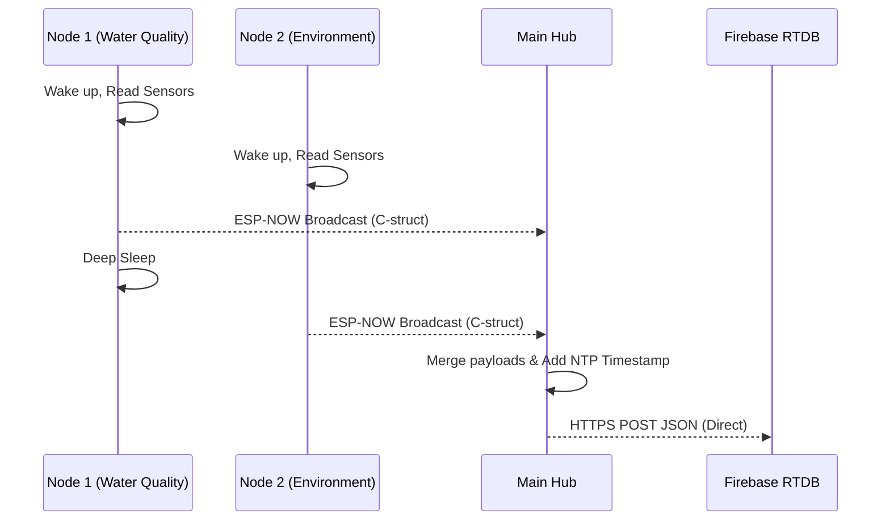

# 💻 Phase 3 — ESP32 Firmware Development (3-Node Architecture)

---

## 📋 Table of Contents

1. [Objectives](#1-objectives)
2. [Node 1 (Water Quality) Firmware Design](#2-node-1-water-quality-firmware-design)
3. [Node 2 (Environment) Firmware Design](#3-node-2-environment-firmware-design)
4. [Main Hub (Display & Comms) Firmware Design](#4-main-hub-display--comms-firmware-design)
5. [ESP-NOW Protocol Implementation](#5-esp-now-protocol-implementation)
6. [BLE Offline Sync Implementation](#6-ble-offline-sync-implementation)
7. [Source Code Reference](#7-source-code-reference)
8. [Testing Procedures](#8-testing-procedures)
9. [Validation Checklist](#9-validation-checklist)

---

## 1. Objectives

| # | Objective | Priority |
|---|-----------|----------|
| 1 | Implement Node 1 firmware to read water quality sensors and transmit via ESP-NOW | 🔴 Critical |
| 2 | Implement Node 2 firmware to read environmental sensors and transmit via ESP-NOW | 🔴 Critical |
| 3 | Implement Main Hub firmware to receive ESP-NOW data, update the TFT display, and broadcast BLE | 🔴 Critical |
| 4 | Develop the BLE server to stream data to the Flet Mobile App for offline sync | 🔴 Critical |
| 5 | Implement robust signal filtering (Kalman, Moving Average) for noisy sensors | 🟠 High |

---

## 2. Node 1 (Water Quality) Firmware Design

**Role:** Dedicated to core water processing.

- **Sensors:** pH (feed/permeate), TDS (feed/permeate), Turbidity (feed), Temperature (feed/permeate), Pressure (feed), Level (feed/product), Flow (feed/permeate).
- **Actuators:** RO Pump Relay, Solenoid Valve Relay.
- **Logic:**
  - Reads analog sensors (ADC1 only).
  - Applies Kalman filters to pH and TDS to smooth out pump noise.
  - Applies moving average filters to Flow rate readings.
  - Reads Pressure from G1/4 sensor via linear voltage conversion.
  - Controls the RO pump logic (e.g., turn on if feed tank is full and product tank is not).
  - Packages data into a `struct` and transmits to the Main Hub via ESP-NOW every 5 seconds.

---

## 3. Node 2 (Environment) Firmware Design

**Role:** Handles ambient environment and air quality.

- **Sensors:** Ultrasonic (Tank levels), DHT22, Gas Sensors (MQ series), DS18B20 (Water temp).
- **Actuators:** 3x Cooling Fan Relays.
- **Logic:**
  - Reads ultrasonic sensors to determine exact tank fill percentages.
  - Calculates gas ppm levels based on `Ro` baseline calibration.
  - Automatically triggers cooling fans if ambient/water temperature exceeds safe thresholds.
  - Packages data into a `struct` and transmits to the Main Hub via ESP-NOW every 5 seconds.

---

## 4. Main Hub (Display & Comms) Firmware Design

**Role:** The centralized UI and communication bridge.

- **Hardware:** ESP32S + Optional 5-inch SPI TFT LCD Module.
- **Logic:**
  - **ESP-NOW Receiver:** Listens asynchronously for packets from Node 1 and Node 2.
  - **Data Merging:** Combines the C-struct data from both nodes into a single comprehensive JSON payload, injecting an NTP-synchronized timestamp.
  - **Firebase Integration (WiFi):** Connects to the local WiFi router and uses the `Firebase_ESP_Client` library to upload the merged JSON directly to the Firebase Realtime Database (`live_data` and `historical_logs`).
  - **BLE Server:** Acts as a BLE Peripheral. 
    - **Notify Characteristic:** Streams the merged JSON to the Mobile App every 3 seconds.
    - **Write Characteristic:** Listens for commands from the Mobile App, such as `{"cmd": "set_wifi", "ssid": "...", "pass": "..."}`, allowing headless WiFi provisioning via NVS (Non-Volatile Storage).

---

## 5. ESP-NOW Protocol Implementation

ESP-NOW is a fast, connectionless protocol that bypasses the router, making it incredibly reliable for edge IoT deployments.

- **MAC Addresses:** The Main Hub's MAC address is hardcoded into the `config.h` of Node 1 and Node 2. Node 1 and 2 don't connect to a router; they just start their WiFi radio in STA mode.
- **Data Structures:** Data is sent as packed C-structs (`espnow_node1_t`, `espnow_node2_t`) to minimize overhead and ensure instant delivery.
- **Callbacks:** The Hub uses `esp_now_register_recv_cb()` to process data instantly upon arrival. Nodes use `esp_now_register_send_cb()` to verify delivery success.

### 5.1 Firmware Sequence Diagram

---

## 6. BLE Offline Sync Implementation

To solve the lack of an SD Card module, the system buffers data on the user's mobile device.

- **Service UUID:** A custom UUID is defined for the Desalination System (e.g., `4fafc201-1fb5-459e-8fcc-c5c9c331914b`).
- **Notify Characteristic:** A read/notify characteristic streams the aggregated system JSON payload to the Flet mobile app.
- **Write Characteristic:** An RX characteristic allows the mobile app to send JSON commands back to the Hub (e.g. WiFi credentials).
- **Mobile App Role:** The Flet app listens for notifications, and saves every payload to a local SQLite database (`sensor_data.sqlite`).
- **Cloud Sync:** When the mobile app detects an active Internet connection, a background `sync.py` worker automatically uploads the SQLite queue to the FastAPI backend, ensuring zero data loss during power/network outages at the installation site.

---

## 7. Source Code Reference

| Folder | Key Files | Purpose |
|--------|-----------|---------|
| `firmware/Node1_WaterQuality/` | `Node1_WaterQuality.ino`, `config.h` | Core water sensing & pump control. |
| `firmware/Node2_Environment/` | `Node2_Environment.ino`, `config.h` | Environment and fan control. |
| `firmware/Main_Hub/` | `Main_Hub.ino`, `config.h` | Central hub, Display UI, and mobile BLE integration. |

---

## 8. Testing Procedures

1. **Upload Node Firmware:** Flash Node 1 and Node 2. Monitor their serial outputs to ensure ESP-NOW packets are being sent successfully.
2. **Verify Hub Reception:** Flash the Main Hub. Ensure the serial monitor logs incoming packets from both nodes correctly.
3. **Verify TFT Display:** Check that sensor values update on the 5-inch screen within 5 seconds of a physical change.
4. **Test BLE Connection:** Use a mobile app like *nRF Connect* (or your Flet app) to bond with the Hub and subscribe to the characteristic. Ensure data flows continuously.

---

## 9. Validation Checklist

- [ ] Node 1 successfully compiles and sends data via ESP-NOW (including all 7 sensor types)
- [ ] Pressure sensor reads expected 0 bar at atmospheric pressure
- [ ] Node 2 successfully compiles and sends data via ESP-NOW
- [ ] Main Hub successfully receives data from both nodes asynchronously
- [ ] TFT Display renders UI and updates in real-time without blocking
- [ ] BLE Server starts and broadcasts correctly
- [ ] Flet Mobile App successfully pairs and receives BLE data

---

> [!IMPORTANT]  
> Phase 3 represents the completion of the Edge Layer. The physical devices are now fully autonomous IoT nodes capable of interacting with the local display and the mobile app.

---

**Have you completed this phase?**

Reply with **"Phase Completed"** to proceed to **Phase 4: Backend API Development** *(FastAPI on Vercel, Firebase Admin integration, and ML prediction endpoints).*
