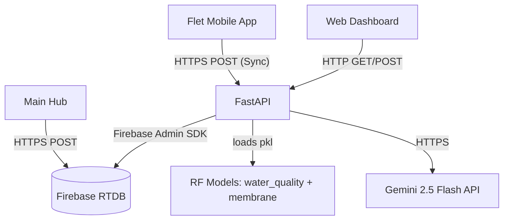

# 🚀 Phase 4 — Backend API Development (FastAPI on Vercel)

---

## 📋 Table of Contents

1. [Objectives](#1-objectives)
2. [Architecture Overview](#2-architecture-overview)
3. [Project Structure](#3-project-structure)
4. [Configuration & Secrets](#4-configuration--secrets)
5. [Firebase Integration](#5-firebase-integration)
6. [ML Prediction Service](#6-ml-prediction-service)
7. [API Endpoints Reference](#7-api-endpoints-reference)
8. [Vercel Deployment](#8-vercel-deployment)
9. [Testing Procedures](#9-testing-procedures)
10. [Validation Checklist](#10-validation-checklist)

---

## 1. Objectives

| # | Objective | Priority |
|---|-----------|----------|
| 1 | Build a production-ready FastAPI backend deployable to Vercel | 🔴 Critical |
| 2 | Integrate both trained ML models (Water Quality + Membrane Status) as REST endpoints | 🔴 Critical |
| 3 | Connect to Firebase Realtime Database using the Admin SDK | 🔴 Critical |
| 4 | Build an alert evaluation engine based on WHO water quality thresholds | 🟠 High |
| 5 | Proxy the Gemini AI API for the in-app chatbot | 🟠 High |
| 6 | Expose a system health endpoint for Vercel uptime monitoring | 🟡 Medium |

---

## 2. Architecture Overview



- **FastAPI** is the single backend, handling ML inference, alerting, and AI chat, as well as ingesting offline-synced data from the mobile app.
- **Main Hub** pushes live data directly to Firebase RTDB, bypassing the backend for real-time sensor updates.
- **Firebase RTDB** is the cloud store for live data, historical logs, and alerts.
- **ML models** are bundled inside the backend — no separate ML service needed.
- Deployed on **Vercel** as Python Serverless Functions.

---

## 3. Project Structure

```
backend/
├── main.py                          — FastAPI app + CORS + router registration
├── requirements.txt                 — All Python dependencies
├── api/
│   └── index.py                     — Vercel serverless entry point
├── ml/
│   ├── water_quality_rf.pkl         — Trained RF classifier (Water Quality)
│   ├── water_quality_encoder.pkl    — LabelEncoder for water quality classes
│   ├── membrane_status_rf.pkl       — Trained RF classifier (Membrane Health)
│   └── membrane_encoder.pkl         — LabelEncoder for membrane classes
└── app/
    ├── core/
    │   ├── config.py                — Pydantic settings (reads from .env)
    │   └── firebase.py              — Firebase Admin SDK singleton
    ├── services/
    │   └── ml_service.py            — Model loader + prediction function
    └── api/v1/
        ├── predict.py               — POST /api/v1/predict
        ├── sensors.py               — POST /api/v1/sensors/ingest, GET /live
        ├── alerts.py                — POST /api/v1/alerts/evaluate, GET /history
        ├── chat.py                  — POST /api/v1/chat
        └── status.py                — GET /api/v1/status/health
```

---

## 4. Configuration & Secrets

All secrets are loaded from the `.env` file in the project root. **Never commit this file to Git** (it is already in `.gitignore`).

| Variable | Description | Example |
|----------|-------------|---------|
| `FIREBASE_DATABASE_URL` | Firebase RTDB URL | `https://your-project-default-rtdb.europe-west1.firebasedatabase.app` |
| `FIREBASE_SERVICE_ACCOUNT_PATH` | Path to Firebase JSON key | `serviceAccountKey.json` |
| `GEMINI_API_KEY` | Google AI Studio API key | `AIzaSy...` |
| `SECRET_KEY` | FastAPI secret (for future auth) | Random 32+ char string |
| `DEFAULT_DEVICE_ID` | Device identifier used in Firebase paths | `device_001` |

> [!CAUTION]
> Add `serviceAccountKey.json` to `.gitignore` immediately. This file contains your private Google Cloud credentials and must **never** be pushed to any repository.

---

## 5. Firebase Integration

Firebase is accessed via the **Admin SDK** using a Service Account key.

**Singleton Pattern (`app/core/firebase.py`):**
- Firebase is initialized once using `firebase_admin.initialize_app()`.
- All endpoints call `get_db_ref(path)` to get a reference to any Firebase RTDB path.

**Database Schema Used:**

```
/devices/device_001/
│   └── live_data/           ← Overwritten every 5 seconds (latest snapshot)
│
/historical_logs/device_001/
│   └── <push_key>/          ← Appended every cycle (permanent record)
│
/alerts/device_001/
│   └── <push_key>/          ← Written only when a threshold is breached
│
/system_status/device_001/   ← Last known device state
```

---

## 6. ML Prediction Service

**File:** `app/services/ml_service.py`

**Models Used:**

| Model | File | Output Classes |
|-------|------|----------------|
| Water Quality Classifier | `water_quality_rf.pkl` | `Excellent`, `Acceptable`, `Poor` |
| Membrane Status Classifier | `membrane_status_rf.pkl` | `Healthy`, `Needs Cleaning`, `Replace` |

**Input Features (13 total):**

| Feature | Description |
|---------|-------------|
| `pH_before` | Raw water pH |
| `TDS_before` | Raw water TDS (ppm) |
| `Turbidity_before` | Raw water turbidity (NTU) |
| `Temperature_before` | Raw water temperature (°C) |
| `Pressure_before` | System pressure (bar) |
| `pH_after` | Treated water pH |
| `TDS_after` | Treated water TDS (ppm) |
| `Turbidity_after` | Treated water turbidity (NTU) |
| `Temperature_after` | Treated water temperature (°C) |
| `Efficiency` | TDS removal efficiency (%) |
| `TDS_Reduction` | Absolute TDS reduction |
| `Turbidity_Reduction` | Absolute turbidity reduction |
| `pH_Change` | Change in pH after treatment |

**Performance:** Models are loaded once at startup using Python's `@lru_cache`, so all subsequent prediction requests are served purely from RAM with minimal latency.

---

## 7. API Endpoints Reference

### `POST /api/v1/sensors/ingest`
Ingests a full sensor snapshot from all nodes (aggregated by the Main Hub or via mobile BLE sync).

**Request Body:**
```json
{
  "ph_feed": 7.2,
  "ph_permeate": 6.9,
  "tds_feed": 320.5,
  "tds_permeate": 12.0,
  "turbidity_feed": 0.8,
  "temperature_feed": 24.5,
  "temperature_permeate": 24.2,
  "pressure_feed": 3.5,
  "flow_rate_feed": 2.1,
  "flow_rate_permeate": 1.5,
  "water_level_feed_tank": 100,
  "water_level_product_tank": 0,
  "pump_status": "running",
  "valve_status": "open",
  "ambient_temp": 28.0,
  "gas_1_ppm": 120.0
}
```
**Response:** `{ "status": "ok", "timestamp": "2026-06-27T..." }`

---

### `GET /api/v1/sensors/live`
Returns the latest live sensor snapshot from Firebase.

---

### `POST /api/v1/predict`
Runs both ML models and returns predictions with confidence scores.

**Response:**
```json
{
  "status": "ok",
  "predictions": {
    "water_quality": {
      "label": "Excellent",
      "confidence": 94.5,
      "probabilities": { "Acceptable": 3.1, "Excellent": 94.5, "Poor": 2.4 }
    },
    "membrane_status": {
      "label": "Healthy",
      "confidence": 87.2,
      "probabilities": { "Healthy": 87.2, "Needs Cleaning": 11.1, "Replace": 1.7 }
    }
  }
}
```

---

### `POST /api/v1/alerts/evaluate`
Evaluates a sensor snapshot against WHO thresholds and writes any triggered alerts to Firebase.

**Thresholds Used:**

| Parameter | Limit | Standard |
|-----------|-------|---------|
| pH | 6.5 – 8.5 | WHO Drinking Water |
| TDS | < 500 ppm | WHO Drinking Water |
| Turbidity | < 4 NTU | WHO Drinking Water |
| Pressure | < 5.5 bar | Operational safety |
| Gas 1 & 2 | < 1000 ppm | Configurable |
| Ambient Temp | < 45 °C | Equipment safety |

---

### `GET /api/v1/alerts/history?limit=20`
Returns the last N alerts from Firebase.

---

### `POST /api/v1/chat`
Proxies a user message to Gemini 2.5 Flash with a system prompt specialized in water desalination expertise, using the implementation from `chatbot.py`.

**Request:**
```json
{
  "message": "Why is my TDS reading 800 ppm after treatment?",
  "context": { "tds_after": 800, "membrane_status": "Needs Cleaning" }
}
```
**Response:** `{ "status": "ok", "reply": "A TDS of 800 ppm after RO treatment suggests..." }`

---

### `GET /api/v1/status/health`
Simple liveness probe for Vercel and uptime monitoring services.
Returns: `{ "status": "healthy", "service": "water-desalination-api" }`

---

## 8. Vercel Deployment

**Configuration file:** `vercel.json` (project root)

```json
{
  "version": 2,
  "builds": [{ "src": "backend/main.py", "use": "@vercel/python" }],
  "routes": [{ "src": "/(.*)", "dest": "backend/main.py" }]
}
```

**Deployment Steps:**

1. Install Vercel CLI: `npm install -g vercel`
2. Run `vercel login` in your terminal.
3. From the project root: `vercel deploy`
4. Set environment variables in the **Vercel Dashboard → Settings → Environment Variables** (same keys as `.env`).
5. Upload your `serviceAccountKey.json` content as a Vercel secret or use a secret manager.

> [!WARNING]
> Vercel Serverless Functions have a **250MB unzipped deployment limit**. The two Random Forest `.pkl` models total ~7MB together — well within this limit.

> [!IMPORTANT]
> **Cold Start Note:** The first request after a period of inactivity will have a small delay (~1–2 seconds) while the Python runtime and ML models initialize. All subsequent requests are fast.

---

## 9. Testing Procedures

1. **Run Locally:**
   ```bash
   cd backend
   uvicorn main:app --reload --port 8000
   ```
2. **Open Swagger UI:** Go to `http://localhost:8000/docs` to view and test all endpoints interactively.
3. **Test Prediction Endpoint:**
   - Use the Swagger UI to POST to `/api/v1/predict` with sample feature values.
   - Verify it returns `water_quality` and `membrane_status` predictions.
4. **Test Firebase Ingest:**
   - POST to `/api/v1/sensors/ingest` with a sample payload.
   - Open Firebase Console and verify `live_data` and `historical_logs` paths are populated.
5. **Test Alert Engine:**
   - POST to `/api/v1/alerts/evaluate` with a TDS value > 500.
   - Verify an alert appears in Firebase under `/alerts/device_001/`.

---

## 10. Validation Checklist

- [ ] `uvicorn main:app --reload` starts without import errors
- [ ] `/docs` Swagger UI loads all 5 endpoint groups
- [ ] `/api/v1/status/health` returns `{ "status": "healthy" }`
- [ ] `/api/v1/predict` returns correct labels and confidence scores
- [ ] `/api/v1/sensors/ingest` writes to Firebase `live_data` and `historical_logs`
- [ ] `/api/v1/alerts/evaluate` correctly flags out-of-range readings
- [ ] `/api/v1/chat` returns Gemini response (requires valid `GEMINI_API_KEY`)
- [ ] `vercel deploy` completes without errors

---

> [!IMPORTANT]
> Phase 4 represents the complete Cloud/Backend Layer. The FastAPI service is now the brain of the system — receiving data from hardware, running ML inference, managing Firebase, and serving the dashboard and mobile app.

---

**Have you completed this phase?**

Reply with **"Phase Completed"** to proceed to **Phase 5: Dashboard & Mobile App Development** *(Flet Web Dashboard on Vercel + Flet Mobile App with BLE + SQLite offline sync).*
